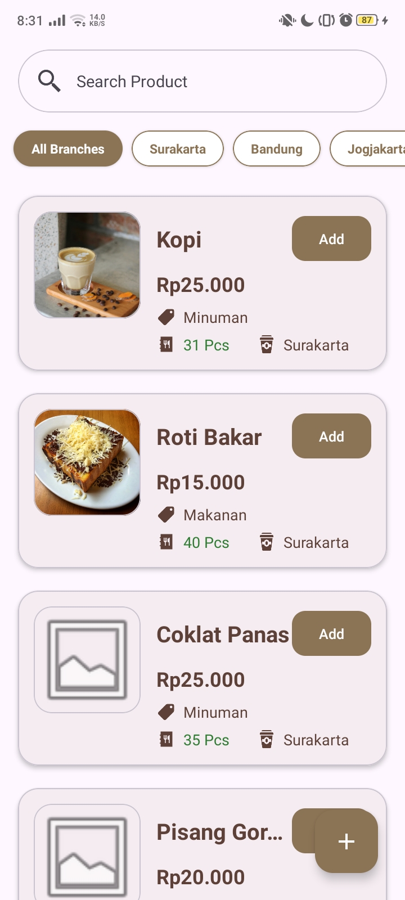

# 🛒 Bianca POS (Point of Sale) Enterprise


**Bianca POS** adalah solusi manajemen *Point of Sale* modern yang dirancang khusus untuk efisiensi bisnis UMKM hingga skala Enterprise. Aplikasi ini mengombinasikan kekuatan **Firebase Realtime Database** untuk sinkronisasi data instan dengan antarmuka **Material 3** yang intuitif.

---

## 📸 Tampilan Aplikasi (Screenshots)

|                                        Login & Register                                        |                  Dashboard Utama                  |                Manajemen Produk                |
|:----------------------------------------------------------------------------------------------:|:-------------------------------------------------:|:----------------------------------------------:|
|   |  |  |

|                 Transaksi Kasir                  |                 Keranjang Belanja                 |                 Nota Digital                 |
|:------------------------------------------------:|:-------------------------------------------------:|:--------------------------------------------:|
|  |  |  |

|                Manajemen Pelanggan                |                Manajemen Pegawai                |                Manajemen Cabang                |
|:-------------------------------------------------:|:-----------------------------------------------:|:----------------------------------------------:|
|  |  |  |

|              Filter Cabang Modern              |                Laporan Penjualan                |               Konfigurasi Printer               |
|:----------------------------------------------:|:-----------------------------------------------:|:-----------------------------------------------:|
|  |  |  |

|                Pengaturan Bahasa                 |                 Dark Mode Theme                  |                Akun & Profil                 |
|:------------------------------------------------:|:------------------------------------------------:|:--------------------------------------------:|
|  |  |  |

---

## 📂 Daftar Aktivitas & Fitur Lengkap

### 🔐 Modul Otentikasi & Akun
*   **Login & Register Activity**: Sistem pendaftaran dan masuk akun aman via Firebase Auth.
*   **Akun Activity**: Manajemen profil, **Logout**, dan akses ke pengaturan profil.
*   **Mod Akun Activity**: **Edit** informasi profil & data toko serta fitur **Hapus (Delete)** akun permanen.

### 🛒 Sistem Transaksi (POS) & Hardware
*   **Transaksi Activity**: Alur kasir lengkap: Pilih **Cabang** → Pilih **Kasir** → Pilih **Pelanggan** → **Tambah Produk** ke Keranjang → **Pembayaran**.
*   **Nota Activity**: Kalkulasi otomatis dan pembuatan **Struk Nota** digital yang siap cetak.
*   **Printer Activity**: Manajemen **List Bluetooth** untuk koneksi ke Thermal Printer.

### 📦 Manajemen Data Operasional (CRUD)
Dukungan penuh fitur **Tambah, Edit, & Hapus** untuk entitas berikut:
*   **Produk**: Manajemen inventaris, harga, dan stok.
*   **Kategori**: Pengelompokan produk dengan *Horizontal Chips*.
*   **Pelanggan**: Database klien untuk histori belanja.
*   **Pegawai**: Pengaturan staf dan hak akses per cabang.
*   **Cabang**: Manajemen multi-lokasi bisnis.

### 📊 Laporan & UI
*   **Laporan Activity**: Melihat seluruh **History Transaksi** untuk audit keuangan.
*   **Settings**: Ganti Bahasa (**ID/EN**) dan Tema (**Light/Dark**) secara adaptif.

---

## 🗄️ Struktur Database (Firebase Realtime Database)

Aplikasi menggunakan struktur JSON NoSQL yang dioptimalkan untuk kecepatan akses:

```json
{
  "akun": { "uid": { "namaToko": "", "email": "", "foto": "" } },
  "produk": { "id_produk": { "nama": "", "harga": 0, "stok": 0, "id_kategori": "", "id_cabang": "" } },
  "kategori": { "id_kategori": { "nama_kategori": "" } },
  "pelanggan": { "id_pelanggan": { "nama": "", "telepon": "", "alamat": "" } },
  "pegawai": { "id_pegawai": { "nama": "", "posisi": "", "id_cabang": "" } },
  "cabang": { "id_cabang": { "nama_cabang": "", "lokasi": "" } },
  "transaksi": { "id_transaksi": { "tanggal": "", "total": 0, "item": [], "id_pelanggan": "", "id_cabang": "" } }
}
```

---

## ✨ Fitur Unggulan

- **🚀 Real-time Cloud Sync**: Data tersinkronisasi otomatis via Firebase.
- **🏬 Multi-Branch Ecosystem**: Manajemen banyak lokasi dalam satu aplikasi.
- **🌗 Material 3 UI**: Desain modern dengan dukungan Dark Mode.
- **🌐 Localization**: Dukungan penuh Bahasa Indonesia & English.
- **🖨️ Thermal Printer**: Cetak struk instan via Bluetooth.

---

## 🚀 Instalasi

1. **Clone**: `git clone https://github.com/bianca3020/cafe-bianca.git`
2. **Config**: Tambahkan `google-services.json` ke folder `app/`.
3. **Run**: Jalankan di Android Studio (disarankan Android 10+).

---
**Developed with ❤️ by [Bianca Putri](https://github.com/bianca3020)**